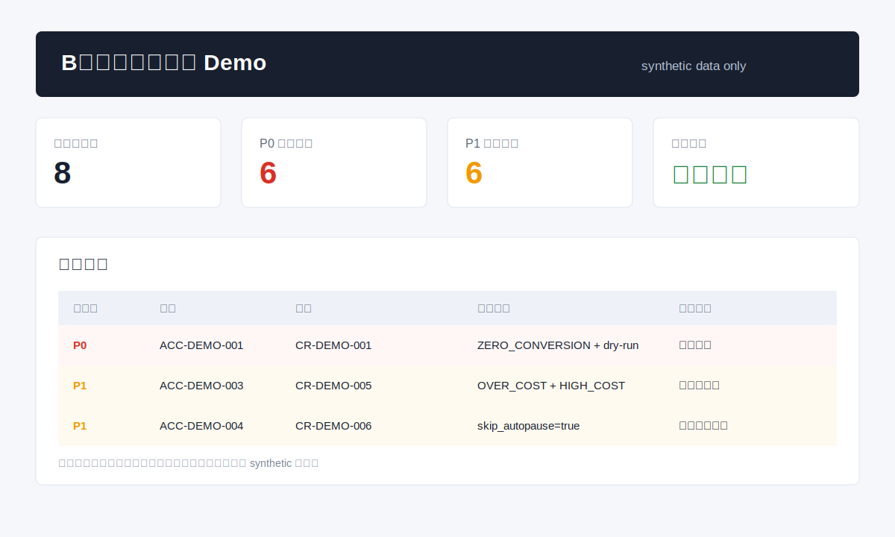

# B站投放巡查系统 Demo

## 产品定位

这是一个面向投放负责人、运营负责人和项目管理者的投放巡查 demo。它模拟真实业务里的“多账户、多创意、多指标、低频人工巡查不及时”的问题，用规则引擎识别异常创意、生成巡查报告，并输出按运营人路由的通知预览。

## 目标用户

| 用户 | 关注点 | 系统要解决的问题 |
|---|---|---|
| 投放负责人 | 消耗、ROI、CPA、空耗 | 快速发现异常创意和账户风险 |
| 运营管理者 | 风险分层、处理优先级、运营人归属 | 不靠人工翻表找问题 |
| 内容/增长负责人 | 哪些素材需要优化或保护 | 把投放异常转成后续动作 |

## MVP 功能

- 读取 synthetic 创意指标数据。
- 读取脱敏规则配置，支持全局阈值和账户级覆盖。
- 计算 CPA、ROI、转化率、CPM、评论点击成本等关键指标。
- 识别超成本、零转化空耗、低效空耗、ROI 下滑、自动关停候选和余额不足。
- 对白名单/保护期创意只告警，不进入自动关停候选。
- 输出巡查报告和通知预览；公开 demo 不连接真实平台，不发送真实通知。

## 数据流

```text
synthetic 创意指标 CSV
  -> 脱敏规则配置 JSON
  -> 创意级规则判断
  -> 账户余额补充检查
  -> 巡查报告 Markdown
  -> 按运营人分组的通知预览 Markdown
  -> 人工确认和复盘
```

## 快速体验



在仓库根目录运行：

```powershell
python .\01-bilibili-ad-inspection-demo\demo\run_inspection_demo.py
```

输入：

- [creative_metrics.csv](demo/sample-data/creative_metrics.csv)
- [rule_config.json](demo/sample-data/rule_config.json)

输出：

- [inspection-report.md](demo/sample-report/inspection-report.md)
- [notification-preview.md](demo/sample-report/notification-preview.md)

## 核心规则

| 告警类型 | 条件摘要 | 输出 |
|---|---|---|
| `OVER_COST` | 消耗超过阈值、已有转化、CPA 高于账户阈值 | 人工复核 |
| `ZERO_CONVERSION` | 消耗超过阈值且转化为 0 | P0 空耗告警 |
| `LOW_CONVERSION_RATE` | 消耗达标、已有转化、转化率低于阈值 | 观察和复盘 |
| `LOW_ROI` | 消耗达标且 ROI 低于阈值 | 复盘告警 |
| `AUTO_PAUSED_CREATIVE` | CPA 命中创意级自动处理条件 | dry-run 关停候选 |
| `AUTO_PAUSED_CAMPAIGN` | 零转化空耗命中计划/创意保护条件 | dry-run 关停候选 |
| `AUTO_PAUSED_CREATIVE_ADVANCED` | 零转化且 CPM、评论点击成本均过高 | dry-run 关停候选 |
| `AUTO_PAUSED_CREATIVE_HIGH_COST` | 有转化但 CPM、评论点击成本均过高 | dry-run 关停候选 |
| `LOW_BALANCE` | 现金余额低于今日或昨日消耗 | 运营人余额提醒 |

## 可复核点

这个 demo 展示的是完整产品判断链路：

1. 真实业务问题：账户和创意多，巡查频率高，人工漏看风险大。
2. 指标体系：消耗、转化、CPA、ROI、转化率、CPM、评论点击成本、余额。
3. 规则系统：全局规则 + 账户级覆盖 + 白名单/保护期。
4. 产品流程：巡查、告警、通知预览、人工确认、复盘。
5. 安全边界：demo 使用 synthetic 数据，不暴露真实账户、人员和投放数据。
