# AI 内容需求研究工作台

## 产品定位

这个 demo 面向内容运营、增长负责人和个人创作者，用来把公开内容、评论问题、业务项目过程和个人思考转成可复用的用户需求洞察、选题池、脚本草稿和发布包。

它不是“让 AI 随便写几条文案”，而是把内容生产前面的用户研究和素材判断做成流程。

## 目标用户

- 需要稳定输出内容的运营负责人。
- 有业务经验但不会系统化选题的个人创作者。
- 想把项目过程变成可传播内容的 AI 增长顾问。

## 核心流程

```text
公开素材 / 评论问题 / 项目过程
  -> 样本准入
  -> 用户痛点提炼
  -> 选题评分
  -> 脚本草稿
  -> 发布包
  -> 复盘回流
```

## Demo 说明



看产品案例：

- [user-research-demo.md](docs/user-research-demo.md)

样例输入：

```text
用户问题：我每天都收藏很多 AI 工具，但不知道怎么真正用到自己的业务流程里。
```

样例输出：

```text
需求洞察：用户不是缺工具，而是缺“从业务问题到可执行流程”的翻译能力。
选题方向：别再收藏 AI 工具了，先把一个重复工作变成流程。
```

## 可复核点

- 能否从评论和业务问题中提炼真实需求。
- 能否设计内容生产流程，而不是只写单篇文案。
- 能否设置评分标准，判断哪些选题值得做。
- 能否保留人工判断边界，不把发布和互动做成无确认自动化。
