# 第三方内容对标改写全链路 Demo

## 产品定位

这个 demo 对应真实流程里的“抖音/小红书等第三方平台内容对标全链路”：从公开内容候选抓取开始，经过样本筛选、转写、样本准入、编导拆解、复用资产沉淀、知识库同步计划，再改写成木易自己的原创脚本和发布包。

它不是“AI 直接仿写文案”，也不是普通选题表。它展示的是如何把第三方平台内容拆成可迁移结构，再替换成自己的项目证据。

## 真实流程的脱敏映射

```text
第三方平台公开内容抓取
  -> 候选视频/图文筛选
  -> 本地转写 / metadata fallback
  -> 导入人工编导工作台
  -> 样本准入卡
  -> 七遍编导拆解
  -> 质量评分
  -> 复用资产沉淀
  -> 知识库同步计划
  -> 改写成木易自己的脚本和发布包
```

公开 demo 不访问真实平台，不读取 cookie/token，不保存真实视频、真实评论、真实昵称或真实知识库路径；所有输入都是 synthetic data。

## 快速体验



在仓库根目录运行：

```powershell
python .\02-third-party-content-remix-pipeline\demo\run_content_chain_demo.py
```

输入：

- [third_party_samples.jsonl](demo/sample-data/third_party_samples.jsonl)
- [demo-ai-workflow-transcript.txt](demo/sample-data/transcripts/demo-ai-workflow-transcript.txt)
- [chain_config.json](demo/sample-data/chain_config.json)

输出：

- [chain-report.md](demo/sample-output/chain-report.md)
- [capture-candidates-report.md](demo/sample-output/capture-candidates-report.md)
- [source-card.md](demo/sample-output/manual-workbench/01-samples/demo-ai-workflow.source-card.md)
- [clean-transcript.md](demo/sample-output/manual-workbench/02-transcripts/demo-ai-workflow.clean-transcript.md)
- [director-decomposition.md](demo/sample-output/manual-workbench/03-decomposition/demo-ai-workflow.director-decomposition.md)
- [quality-review.md](demo/sample-output/manual-workbench/04-quality-review/demo-ai-workflow.decomposition-review.md)
- [reuse-assets.md](demo/sample-output/manual-workbench/09-reuse-library/demo-ai-workflow.reuse-assets.md)
- [knowledge-base-sync-plan.md](demo/sample-output/knowledge-base-sync-plan.md)
- [rewrite-brief.md](demo/sample-output/rewrite-brief.md)
- [script-package.md](demo/sample-output/script-package.md)

## 关键门禁

| 门禁 | 判断内容 | 公开 demo 表达 |
|---|---|---|
| 候选筛选 | 是否服务木易个人 AI 主线、是否有结构价值、是否低风险 | `capture-candidates-report.md` |
| 转写证据 | 是否有可读逐字稿、模型/record 记录、术语疑点 | `clean-transcript.md` |
| 样本准入 | 是否值得深拆、为什么值得、为什么不该搬运 | `source-card.md` |
| 编导拆解 | 整体结构、逐句功能、心理路径、表达技巧、转化设计 | `director-decomposition.md` |
| 质量评分 | `score / reason / evidence / uncertainty / next_action` | `quality-review.md` |
| 资产沉淀 | 钩子、句式、结构、CTA、反例 | `reuse-assets.md` |
| 知识库同步 | 只生成同步计划，不写真实 Obsidian | `knowledge-base-sync-plan.md` |
| 改写创作 | 用自己的项目证据替换原作者案例 | `rewrite-brief.md`、`script-package.md` |

## 可复核点

- 第三方内容不是直接仿写，而是先经过候选筛选和样本准入。
- 转写文本只作为证据来源，拆解必须说明证据和不确定点。
- 沉淀的是结构、句式、CTA 和反例，不是原视频原句。
- 知识库只生成同步计划，真实写入需要人工确认和 Obsidian 路由。
- 最终脚本使用木易自己的项目证据，不冒充原作者案例。
